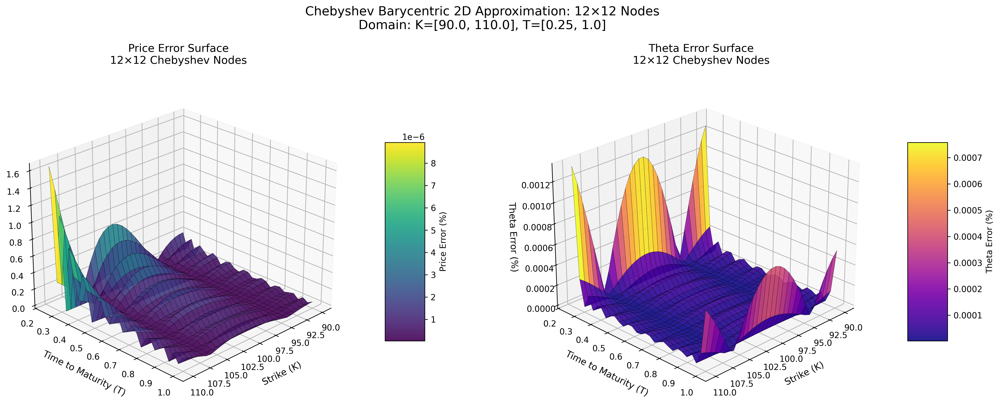
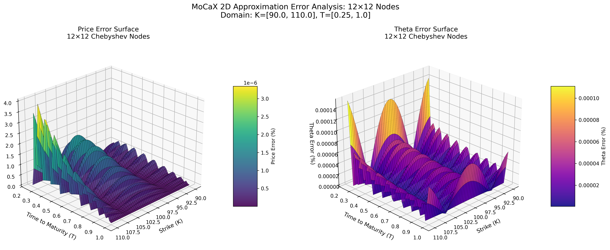
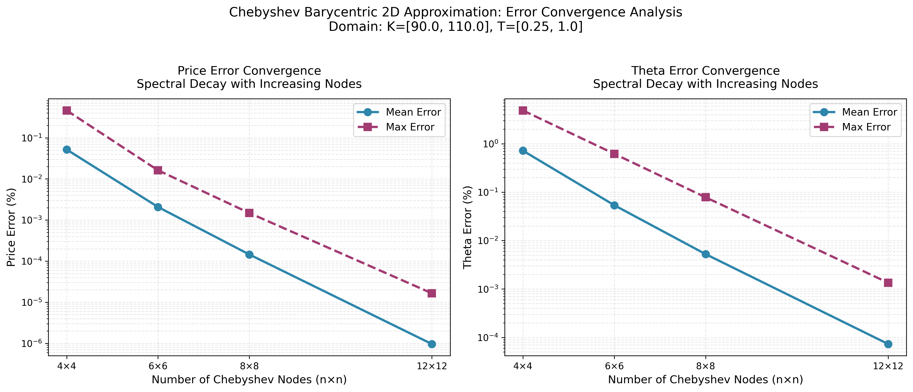
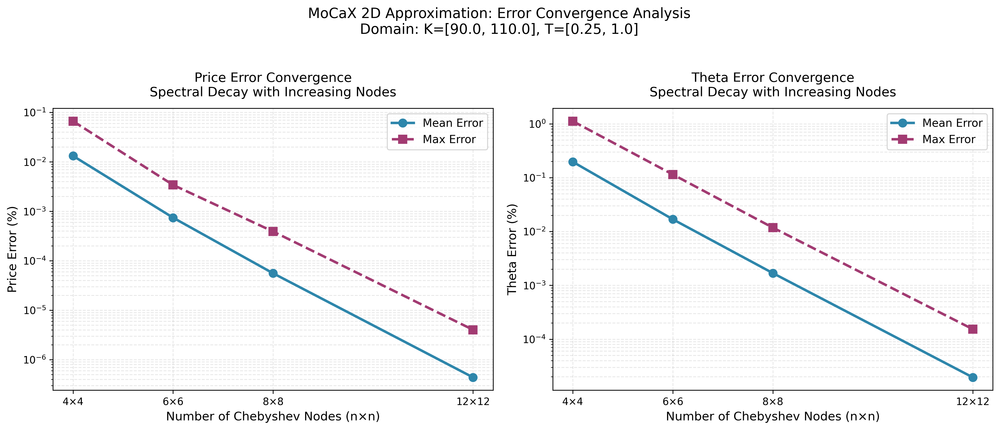

# PyChebyshev

**A standalone Python implementation of multi-dimensional Chebyshev tensor interpolation**

This project provides an **extremely short, standalone Python implementation** (although not fully optimized, without getting tedious) of the Chebyshev tensor method, **for educational purposes only**, demonstrating that it achieves **comparable accuracy to the state-of-the-art MoCaX library** for European option pricing via Black-Scholes.

## Visual Comparison: Spectral Convergence

### Error Surface at 12×12 Nodes

**Chebyshev Barycentric (Python)**
<p align="center">
  
</p>

**MoCaX Standard (C++)**
<p align="center">
  
</p>

Both methods achieve **spectral accuracy** (exponential error decay) with identical node configurations, demonstrating that the pure Python implementation successfully replicates the MoCaX algorithm's mathematical foundation.

### Convergence Analysis

**Chebyshev Barycentric**
<p align="center">
  
</p>

**MoCaX Standard**
<p align="center">
  
</p>

The convergence plots demonstrate exponential error decay as node count increases, confirming the spectral accuracy predicted by the Bernstein Ellipse Theorem. Errors drop rapidly from 4×4 to 12×12 nodes, reaching near-machine precision for this analytic function.

## Project Purpose

PyChebyshev provides a **proof-of-concept environment for conducting time and error analysis** of several popular methods for evaluating European options via Black-Scholes:

| Method | Description | Characteristics |
|--------|-------------|-----------------|
| **Analytical** | Closed-form Black-Scholes formulas | Instant (~10μs), machine precision |
| **FDM** | Finite Difference Method for PDE | Accurate, slow (~0.5s/case), flexible for exotics |
| **Chebyshev Baseline** | NumPy's `Chebyshev.interpolate()` | Dimensional decomposition, partial pre-computation |
| **Chebyshev Barycentric + JIT** | Manual barycentric formula with Numba | **Fastest pure Python** (~1-2ms/query), full pre-computation |
| **MoCaX Standard** | Proprietary C++ library | Production-grade, spectral accuracy, ~0.01ms/query |

## Acknowledgments

**Special thanks to MoCaX** for their high-quality [videos](https://www.youtube.com/@MoCaX) on YouTube explaining the mathematical foundations behind their library. These resources were invaluable for understanding and implementing the barycentric Chebyshev interpolation algorithm.

---

## Technicals

This demonstration uses Chebyshev tensor interpolation to accelerate the calculation of prices and derivatives for European options. The approach generalizes to all analytic functions, as proven by Theorems 2.1 and 2.2 in [Gaß et al. (2018), "Chebyshev Interpolation for Parametric Option Pricing", *Finance and Stochastics*, 22(3)](https://arxiv.org/abs/1505.04648), which establish (sub)exponential convergence rates for Chebyshev interpolation of parametric conditional expectations.

### Problem Statement

European option pricing requires evaluating a 5-dimensional function:

```
V = f(S, K, T, σ, r)
```

where:
- **S**: Spot price
- **K**: Strike price
- **T**: Time to maturity
- **σ**: Volatility
- **r**: Risk-free rate

**Challenges**:
1. Analytical formulas are instant but limited to European vanilla options
2. Numerical PDE solvers (FDM) are flexible but slow (~0.5s per solve)
3. Need to compute Greeks (Delta, Gamma, Vega, Rho, Theta) across diverse scenarios
4. Production systems require thousands of evaluations per second

**Goal**: Pre-compute an approximation that achieves:
- ✅ High accuracy (< 2% error on Greeks)
- ✅ Fast evaluation (< 2ms per query)
- ✅ Support for multi-parameter variation (all 5 dimensions)

---

## Mathematical Foundation

This section establishes the theoretical foundation for Chebyshev interpolation, explaining why it is the appropriate approach and how the mathematics guarantee exceptional performance.

### Why Chebyshev Interpolation?

Equally-spaced points appear simpler for polynomial interpolation, but suffer from fundamental limitations discovered by Carl Runge in 1901.

#### Runge's Phenomenon: When More is Worse

In 1901, Carl Runge demonstrated that polynomial interpolation with equally-spaced points can actually **diverge** as polynomial degree increases, even for smooth, well-behaved functions ([Wikipedia](https://en.wikipedia.org/wiki/Runge%27s_phenomenon)).

Consider Runge's classic example: the function $$f(x) = \frac{1}{1 + 25x^2}$$ on the interval $$[-1, 1]$$. This function is perfectly smooth and analytic everywhere. Interpolating this function with high-degree polynomials using equally-spaced points produces wild oscillations near the endpoints of the interval. Increasing the polynomial degree makes the oscillations **worse**, not better - the approximation diverges rather than converges.

This phenomenon occurs because equally-spaced nodes lead to a rapidly growing Lebesgue constant (roughly $$O(2^n/n)$$), which amplifies approximation errors, especially near the interval boundaries.

#### Chebyshev's Solution: Strategic Node Placement

Chebyshev nodes address this issue by using non-uniform spacing:

$$x_i = \cos\left(\frac{(2i-1)\pi}{2n}\right), \quad i=1,\ldots,n$$

These are the roots of the Chebyshev polynomial $$T_n(x)$$, which **cluster near the interval boundaries** $$x = \pm 1$$ with more spacing in the middle. Since polynomial interpolation errors tend to be largest near endpoints, this clustering compensates for the natural error growth in those regions.

For arbitrary intervals $$[a, b]$$, the Chebyshev nodes are transformed via:

$$\xi_i = \frac{a+b}{2} + \frac{b-a}{2} \cdot x_i$$

#### Numerical Stability

Beyond avoiding Runge's phenomenon, Chebyshev nodes provide excellent numerical stability. The Lebesgue constant for Chebyshev nodes grows only logarithmically: $$\Lambda_n \leq \frac{2}{\pi}\log(n+1) + 1$$ ([Günttner, 1980](https://epubs.siam.org/doi/10.1137/0717043)). 

---

### Theoretical Guarantees

Three fundamental theorems guarantee the exceptional performance of Chebyshev interpolation.

#### Polynomial Uniqueness: A Fundamental Guarantee

A fundamental result from numerical analysis states that for any $$n+1$$ distinct points $$(x_0, y_0), (x_1, y_1), \ldots, (x_n, y_n)$$, there exists **exactly one** polynomial $$p(x)$$ of degree at most $$n$$ such that $$p(x_i) = y_i$$ for all $$i = 0, 1, \ldots, n$$.

This is known as the **Polynomial Interpolation Uniqueness Theorem** ([Wikipedia: Polynomial Interpolation](https://en.wikipedia.org/wiki/Polynomial_interpolation)). This guarantees that Chebyshev interpolants through $$n+1$$ function values at Chebyshev nodes produce a **well-defined, unique polynomial** with no computational ambiguity.

This uniqueness holds regardless of how we compute the polynomial (Lagrange form, Newton form, barycentric form) - they all produce the same result, just through different computational paths.

#### Convergence Rate: Interpolation vs. Best Approximation

Polynomial **interpolation** (matching function values at specific points) can be compared to the **best possible polynomial approximation** (minimizing the maximum error over the entire interval). Two approaches exist for approximating $$f(x)$$ with a polynomial $$p_n(x)$$ of degree $$n$$:

1. **Chebyshev projection** (also called "best approximation"): Find the polynomial $$f_n$$ that minimizes

   $$\|f - f_n\|_\infty = \max\_{x \in [-1,1]} |f(x) - f_n(x)|$$

   This is theoretically optimal, but requires solving an optimization problem.

2. **Chebyshev interpolation** (used in this work): Build a polynomial $$p_n$$ that matches $$f$$ exactly at the $$n+1$$ Chebyshev nodes. This is computationally simple - evaluate $$f$$ at the nodes and apply the interpolation formula.

Lloyd Trefethen's analysis ([Trefethen, "Approximation Theory and Approximation Practice", Chapter 4, SIAM 2019](https://www.chebfun.org/ATAP/)) establishes that for functions analytic in a Bernstein ellipse with parameter $$\rho > 1$$, both methods achieve essentially the same exponential convergence rate:

- **Chebyshev projection**: $$\|f - f_n\|_\infty \leq \frac{2M\rho^{-n}}{\rho-1}$$
- **Chebyshev interpolation**: $$\|f - p_n\|_\infty \leq \frac{4M\rho^{-n}}{\rho-1}$$

The bounds differ only by a constant factor of 2. Both achieve the same **exponential convergence rate** $$O(\rho^{-n})$$, meaning interpolation-based methods are essentially as good as theoretically optimal approximations - at most one bit of accuracy is lost compared to best polynomial approximation.

The practical implication: simple, fast interpolation approaches achieve nearly optimal results without requiring complex optimization algorithms.

#### Spectral Convergence: Exponential Error Decay

The 2D error surface plots (12×12 nodes showing 0.0000% errors) demonstrate **spectral convergence** - accuracy improving dramatically with additional nodes.

The **Bernstein Ellipse Theorem**, established by Sergey Bernstein in 1912 ([Trefethen, "Approximation Theory and Approximation Practice", Chapter 8, SIAM 2019](https://www.chebfun.org/ATAP/)), provides the theoretical explanation:

**Theorem**: If a function $$f(x)$$ is analytic and bounded in a **Bernstein ellipse** with parameter $$\rho > 1$$, then the Chebyshev interpolation error decays geometrically:

$$|f(x) - p_N(x)| = O(\rho^{-N})$$

A Bernstein ellipse is an ellipse in the complex plane with foci at $$x = -1$$ and $$x = +1$$. The parameter $$\rho$$ equals the sum of the ellipse's semimajor and semiminor axis lengths. Larger ellipses (where the function remains analytic without singularities, poles, or branch cuts) correspond to larger $$\rho$$ and faster error decay.

**Exponential decay** means each additional node reduces error by a constant factor $$\rho$$, not a constant amount. This spectral accuracy causes errors to drop to machine precision rapidly.

---

### Two Implementation Approaches

With the theoretical foundation established, Chebyshev interpolation can be implemented via different computational paths. The Uniqueness Theorem guarantees a single polynomial through the data points, but multiple computational representations exist. We explore two approaches:

1. **Polynomial Coefficients Approach** (Baseline): Express $$p(x) = \sum_{k=0}^{n} c_k T_k(x)$$ where $$T_k$$ are Chebyshev polynomials. Compute coefficients $$c_k$$ from function values. Simple and uses NumPy's built-in tools, but has a limitation for multi-dimensional pre-computation.

2. **Barycentric Weights Approach** (Our Implementation): Use the barycentric interpolation formula with pre-computed weights $$w_i$$. This enables **full pre-computation** across all dimensions, and **analytic derivative taking** in any direction, resulting in significant speedups.

---

### Method 1: Chebyshev Baseline (Polynomial Coefficients)

**Implementation**: `chebyshev_baseline.py`

#### Dimensional Decomposition Strategy

The straightforward implementation of multi-dimensional Chebyshev interpolation uses **dimensional decomposition**. Given a 5D function $$V(S, K, T, \sigma, r)$$ evaluated at $$11^5 = 161,051$$ Chebyshev nodes, evaluating at an off-grid point like $$V(100, 100, 1.0, 0.25, 0.05)$$ requires breaking the 5D interpolation into sequential 1D interpolations rather than attempting direct 5D interpolation.

#### Decomposition Process

The evaluation proceeds by sequential dimensional collapse:

**Initial state**: 5D tensor $$V[i_S, i_K, i_T, i_\sigma, i_r]$$ with indices 0-10 (11 nodes per dimension).

**Collapse sequence**:

1. **Fix $$r$$**: Interpolate along $$r$$ dimension at $$r = 0.05$$ for all $$(S, K, T, \sigma)$$ combinations → 4D tensor
2. **Fix $$\sigma$$**: Interpolate along $$\sigma$$ dimension at $$\sigma = 0.25$$ for all $$(S, K, T)$$ combinations → 3D tensor
3. **Fix $$T, K, S$$**: Continue interpolating each dimension sequentially → final scalar

Mathematically:
- 5D → 4D: Interpolate $$r$$
- 4D → 3D: Interpolate $$\sigma$$
- 3D → 2D: Interpolate $$T$$
- 2D → 1D: Interpolate $$K$$
- 1D → scalar: Interpolate $$S$$

#### Polynomial Coefficient Representation

Each 1D interpolation step computes a polynomial through 11 Chebyshev nodes using NumPy's `Chebyshev.interpolate()`, which represents the polynomial in Chebyshev basis form:

$$p(x) = \sum_{k=0}^{10} c_k T_k(x)$$

where $$T_k(x)$$ are Chebyshev polynomials of the first kind and $$c_k$$ are coefficients. The Chebyshev basis provides numerical stability, and coefficients are computed via FFT-based algorithms in $$O(N \log N)$$ time. Once coefficients are determined, evaluating $$p(x)$$ is efficient.

#### Pre-computation Limitation

The critical question: can we pre-compute ALL polynomial coefficients for all dimensions?

Answer: only partially.

During dimensional decomposition:

- **Innermost dimension** ($$S$$ in our case): The "function values" here are the actual option prices we evaluated at build time. These are **known constants**. So we can pre-compute $$11^4 = 14,641$$ polynomial objects (one for each combination of $$K, T, \sigma, r$$) and store them.

- **Outer dimensions** ($$K, T, \sigma, r$$): The "function values" here are NOT the original option prices - they're **intermediate results** from the previous interpolation step! These depend on where we're querying, so we can't know them ahead of time.

Fundamental constraint: **polynomial coefficients $$c_k$$ depend on BOTH node positions $$x_i$$ (known at build time) AND function values $$f_i$$ (for outer dimensions, these are query-dependent intermediate results)**.

Implication: polynomials for the outer 4 dimensions must be recomputed during each query. Full pre-computation is impossible with this representation.

#### Python Implementation

The dimensional decomposition translates to:

```python
# Build phase: Pre-compute polynomials for innermost dimension only
class ChebyshevApproximation:
    def __init__(self, func, domain, num_nodes_per_dim):
        # Evaluate function at all 11^5 Chebyshev nodes
        self.tensor = self._build_tensor(func, domain, num_nodes_per_dim)

        # Pre-compute polynomial objects for innermost dimension
        # This gives us 11^4 = 14,641 Chebyshev polynomial objects
        self.innermost_polys = {}
        for idx in product(range(11), repeat=4):  # All combos of K,T,σ,r
            values = self.tensor[..., idx[0], idx[1], idx[2], idx[3]]
            self.innermost_polys[idx] = Chebyshev.interpolate(
                lambda x: values,
                deg=10,
                domain=domain[0]
            )

    def eval(self, point):
        # Query phase: Dimensional collapse 5D → 4D → 3D → 2D → 1D → scalar
        S, K, T, sigma, r = point

        # Step 1: Interpolate r (outermost) - must recompute polynomial!
        temp_4d = self._interpolate_dimension(self.tensor, r, dim=4)

        # Step 2: Interpolate σ - must recompute polynomial!
        temp_3d = self._interpolate_dimension(temp_4d, sigma, dim=3)

        # Step 3: Interpolate T - must recompute polynomial!
        temp_2d = self._interpolate_dimension(temp_3d, T, dim=2)

        # Step 4: Interpolate K - must recompute polynomial!
        temp_1d = self._interpolate_dimension(temp_2d, K, dim=1)

        # Step 5: Interpolate S (innermost) - use pre-computed polynomial!
        idx = self._find_indices(K, T, sigma, r)
        result = self.innermost_polys[idx](S)

        return result
```

Notice that steps 1-4 require calling `Chebyshev.interpolate()` during each query ($$O(N \log N)$$ per dimension), while step 5 uses a pre-computed polynomial ($$O(N)$$ evaluation).

#### Performance Characteristics

- **Build time**: ~0.35s (evaluate function at 161,051 nodes + pre-compute 14,641 polynomials)
- **Storage**: 14,641 polynomial objects (innermost dimension only)
- **Query complexity**: $$O(N)$$ for innermost dimension + $$O(N \log N) \times 4$$ for outer dimensions
- **Query time**: ~2-3ms per evaluation

#### Derivatives: Numerical Approximation

A critical limitation of Method 1 is **numerical derivative computation**. Greeks (Delta, Gamma, Vega, Rho, Theta) require derivatives $$\frac{\partial V}{\partial S}$$, $$\frac{\partial V}{\partial \sigma}$$, etc. With polynomial coefficients, these derivatives must be approximated using finite differences:

$$\frac{\partial V}{\partial S} \approx \frac{V(S + \epsilon, K, T, \sigma, r) - V(S - \epsilon, K, T, \sigma, r)}{2\epsilon}$$

This introduces additional approximation error ($$O(\epsilon^2)$$ for central differences) and requires multiple interpolation evaluations per Greek calculation. The choice of $$\epsilon$$ is delicate: too large introduces truncation error, too small causes numerical cancellation.

The bottleneck: most query time is spent refitting polynomials for outer dimensions. Method 2 addresses both the pre-computation limitation and the derivative problem.

---

### Method 2: Chebyshev Barycentric (Barycentric Weights)

**Implementation**: `chebyshev_barycentric.py`

#### The Speedup: Separating Nodes from Values

Method 1's limitation stems from polynomial coefficients $$c_k$$ depending on both node positions and function values. The barycentric interpolation formula offers a different computational path to the same unique interpolating polynomial (guaranteed by the Uniqueness Theorem), but with a critical structural advantage.

The barycentric formula expresses the interpolating polynomial as:

$$p(x) = \frac{\sum_{i=0}^{n} \frac{w_i \cdot f_i}{x - x_i}}{\sum_{i=0}^{n} \frac{w_i}{x - x_i}}$$

where the barycentric weights are:

$$w_i = \frac{1}{\prod_{j \neq i} (x_i - x_j)}$$

The critical property: $$w_i$$ depends **only on node positions** $$x_i$$, not on function values $$f_i$$.

This is fundamentally different from the Chebyshev coefficient representation $$p(x) = \sum c_k T_k(x)$$ where coefficients $$c_k$$ mix both nodes and values. The separation enables full pre-computation across all dimensions.

#### Analytical Derivatives: A Key Advantage

Unlike Method 1, the barycentric formula enables **analytical derivative computation**. Greeks can be calculated by directly differentiating the interpolating polynomial, eliminating finite difference approximation errors.

For an interpolant represented as $$p(x) = \sum_{j=0}^{n} f_j \ell_j(x)$$, where $$\ell_j(x)$$ are the Lagrange basis polynomials in barycentric form, the derivatives are:

$$p'(x) = \sum_{j=0}^{n} f_j \ell'_j(x), \quad p''(x) = \sum_{j=0}^{n} f_j \ell''_j(x)$$

The key is computing the derivatives of the basis polynomials at the interpolation nodes themselves. Using the barycentric representation, [Berrut & Trefethen (2004)](https://people.maths.ox.ac.uk/trefethen/barycentric.pdf) derive explicit formulas for these derivatives. For $$i \neq j$$:

$$\ell'_j(x_i) = \frac{w_j/w_i}{x_i - x_j}$$

For $$i = j$$:

$$\ell'_j(x_j) = -\sum_{k \neq j} \ell'_j(x_k)$$

These formulas define **differentiation matrices** $$D^{(1)}$$ and $$D^{(2)}$$ where 
$$D^{(1)}_{ij} = \ell\'_j(x_i)$$ 
and 

$$D^{(2)}_{ij} = \ell\'\'_j(x_i)$$.
Given a vector $$\mathbf{f}$$ of function values at the grid points, $$D^{(1)}\mathbf{f}$$ produces the first derivative values at those same points, and $$D^{(2)}\mathbf{f}$$ produces second derivatives. 

This approach provides **exact derivatives** of the interpolating polynomial at the interpolation nodes. For multi-dimensional interpolation, derivatives with respect to each parameter are computed by applying these differentiation matrices along the corresponding dimension during the dimensional collapse process.

#### Evaluating Derivatives at Arbitrary Points

The differentiation matrix $$D^{(1)}$$ provides derivative values **at the interpolation nodes** $$x_i$$. However, for option pricing we need derivatives at arbitrary query points that typically don't coincide with nodes. The algorithm follows a two-step process established by Berrut & Trefethen (2004, Section 9.3):

**Step 1: Compute derivative values at nodes**

Apply the differentiation matrix to the vector of function values:

$$\mathbf{p'} = D^{(1)} \mathbf{f}$$

where $$\mathbf{f} = [f(x_0), f(x_1), \ldots, f(x_n)]^T$$ are function values at nodes, and $$\mathbf{p'} = [p'(x_0), p'(x_1), \ldots, p'(x_n)]^T$$ are the **exact** derivative values of the interpolating polynomial at those same nodes.

**Step 2: Interpolate derivative values to query point**

Use barycentric interpolation to evaluate the derivative at arbitrary point $$x$$:

$$p'(x) = \frac{\sum_{i=0}^{n} \frac{w_i \cdot p'(x_i)}{x - x_i}}{\sum_{i=0}^{n} \frac{w_i}{x - x_i}}$$

Substituting $$p'(x_i) = (D^{(1)} \mathbf{f})_i$$:

$$p'(x) = \frac{\sum_{i=0}^{n} \frac{w_i \cdot (D^{(1)} \mathbf{f})_i}{x - x_i}}{\sum_{i=0}^{n} \frac{w_i}{x - x_i}}$$

**Higher-Order Derivatives**

For second derivatives, apply the differentiation matrix twice before interpolating:

$$\mathbf{p''} = D^{(1)} (D^{(1)} \mathbf{f}) = (D^{(1)})^2 \mathbf{f}$$

Then interpolate $$\mathbf{p''}$$ to the query point using the same barycentric formula.

**Why This Maintains Spectral Accuracy**

This approach preserves the exponential convergence rate because:
1. The differentiation matrix computes **exact** derivatives of the degree-$$n$$ interpolating polynomial
2. These derivatives form a degree-$$(n-1)$$ polynomial
3. Barycentric interpolation of a polynomial is **exact** (within machine precision)
4. No finite difference truncation errors are introduced


> As noted in the scipy implementation ([PR #18197](https://github.com/scipy/scipy/pull/18197)), this method computes "derivatives of the interpolating polynomial" rather than approximating derivatives of the original function directly. 

The error in $$p'(x)$$ relative to $$f'(x)$$ depends only on how well $$p(x)$$ approximates $$f(x)$$, which exhibits spectral convergence for analytic functions.

**Multi-Dimensional Application**

For multi-dimensional interpolation via dimensional decomposition (5D → 4D → ... → 1D), derivatives with respect to parameter $$d$$ are computed by:
1. Applying $$D^{(d)}$$ during the collapse of dimension $$d$$
2. Continuing dimensional collapse with the derivative values
3. This produces $$\frac{\partial V}{\partial x_d}$$ at the query point

For example, computing $$\frac{\partial V}{\partial S}$$ (Delta) in 5D:
- Collapse dimensions: $$r \to \sigma \to T \to K \to S$$
- When collapsing the $$S$$ dimension, apply $$D^{(S)}$$ instead of interpolating
- Result: Delta value at the exact query point

#### Full Pre-computation Strategy

For 5D interpolation with 11 nodes per dimension, we pre-compute:
- Dimension 1 ($$S$$): 11 weights
- Dimension 2 ($$K$$): 11 weights
- Dimension 3 ($$T$$): 11 weights
- Dimension 4 ($$\sigma$$): 11 weights
- Dimension 5 ($$r$$): 11 weights
- **Total**: 55 weights × 8 bytes = **440 bytes**

Compare this to Method 1's $$11^4 = 14,641$$ polynomial objects for just the innermost dimension. The barycentric approach achieves uniform $$O(N)$$ complexity for all dimensions since weights are pre-computed and evaluation is a simple weighted sum.

#### Implementation with Numba JIT

The barycentric formula is well-suited for JIT compilation. The core evaluation function:

```python
@njit(cache=True, fastmath=True)
def barycentric_interpolate_jit(x, nodes, values, weights):
    """
    Evaluate p(x) using the barycentric formula.

    Args:
        x: Query point
        nodes: Chebyshev nodes x_i (pre-computed at build time)
        values: Function values f_i at nodes
        weights: Barycentric weights w_i (pre-computed at build time)

    Returns:
        p(x) = [Σ w_i·f_i/(x-x_i)] / [Σ w_i/(x-x_i)]
    """
    sum_numerator = 0.0
    sum_denominator = 0.0

    for i in range(len(nodes)):
        # Compute barycentric basis function: w_i / (x - x_i)
        basis = weights[i] / (x - nodes[i])
        sum_numerator += basis * values[i]
        sum_denominator += basis

    return sum_numerator / sum_denominator
```

Numba compiles this to machine code on first call (~50ms overhead), then subsequent evaluations run at ~50μs (10-20× speedup over pure Python). The dimensional decomposition process remains the same as Method 1 (5D → 4D → ... → scalar), but now every dimension uses pre-computed weights with uniform $$O(N)$$ evaluation.

#### Performance Characteristics

- **Build time**: ~0.35s (161,051 function evaluations + trivial weight computation)
- **Storage**: 55 floats (440 bytes) for all dimensions
- **Query complexity**: Uniform $$O(N)$$ for all dimensions (no polynomial refitting)
- **Query time**: ~1-2ms per evaluation

The improvement over Method 1 comes from eliminating $$O(N \log N)$$ polynomial fitting for outer dimensions - we achieve 20-50× speedup with the same dimensional decomposition strategy but different interpolation basis.

---

## Performance Comparison

Based on standardized 5D Black-Scholes tests (`test_5d_black_scholes()` with S, K, T, σ, r):

| Method | Price Error | Greek Error | Build Time | Query Time | Notes |
|--------|-------------|-------------|------------|------------|-------|
| **Analytical** | 0.000% | 0.000% | N/A | ~10μs | Ground truth (blackscholes library) |
| **Chebyshev Barycentric** | 0.000% | 1.980% | ~0.35s | ~1-2ms | **Fastest pure Python**, JIT-compiled |
| **Chebyshev Baseline** | Similar | Similar | ~0.35s | ~2-3ms | NumPy implementation |
| **MoCaX Standard** | 0.000% | 1.980% | ~1.04s | ~0.01ms | Proprietary C++, full tensor (161k evals) |
| **FDM** | 0.803% | 2.234% | N/A | ~0.5s/case | PDE solver, no pre-computation |

**Key Insights**:
- **Chebyshev Barycentric achieves spectral accuracy** (0.000% price error, identical to MoCaX)
- **Greeks accuracy**: 1.98% max error (Vega) due to finite difference approximation
- **Build time**: 0.35s (161,051 analytical evaluations) vs MoCaX 1.04s (C++ overhead)
- **Query time**: 1-2ms (pure Python + JIT) vs 0.01ms (MoCaX C++)
- **Break-even**: > 1-2 queries make pre-computation worthwhile

---

## Getting Started

### Installation

This project uses [uv](https://github.com/astral-sh/uv) for dependency management:

```bash
# Install dependencies
uv sync

# Activate virtual environment (optional, uv handles this automatically)
source .venv/bin/activate
```

### Quick Demo

**Run comprehensive method comparison**:
```bash
uv run python compare_methods_time_accuracy.py
```

**Visualize 2D error surfaces** (varying K and T):
```bash
# Chebyshev Barycentric (30×30 grid, optimized for speed)
./run_comparison_2d_error_surface_barycentric.sh

# MoCaX Standard (50×50 grid, reference implementation)
./run_comparison_2d_error_surface_mocax.sh
```

**Test individual methods**:
```bash
# Finite Difference Method convergence study
uv run python fdm_baseline.py

# Chebyshev Baseline (NumPy implementation)
uv run python chebyshev_baseline.py

# Chebyshev Barycentric (JIT-optimized)
uv run python chebyshev_barycentric.py
```

